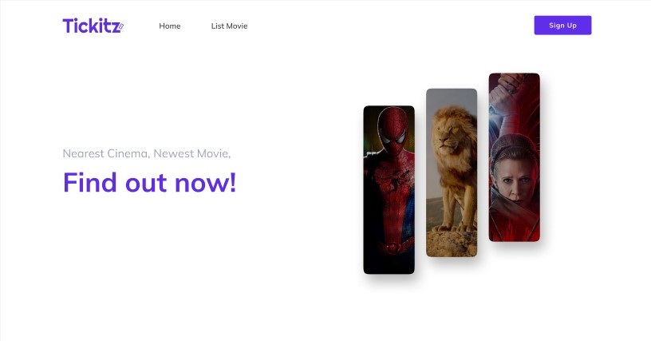

<h1 align="center">
  React With Redux: Rental Vehicle Frontend
</h1>

<p align="center"></p>

## 🛠️ Installation Steps

1. Clone the repository

```bash
git clone https://github.com/vickyelfathea/rental-vehicle-ui.git
```

2. Install dependencies

```bash
npm install
```

3. Run the app

```bash
npm start
```

🌟 You are all set!

## 💻 Built with

- [Nodejs](https://nodejs.org/en/)
- [Expressjs](https://expressjs.com/): for handle http method
- [Postgres](https://www.postgresql.org/): for DBMS

<hr>
<p align="center">
Developed with ❤️ in Indonesia 	🇮🇩
</p>
